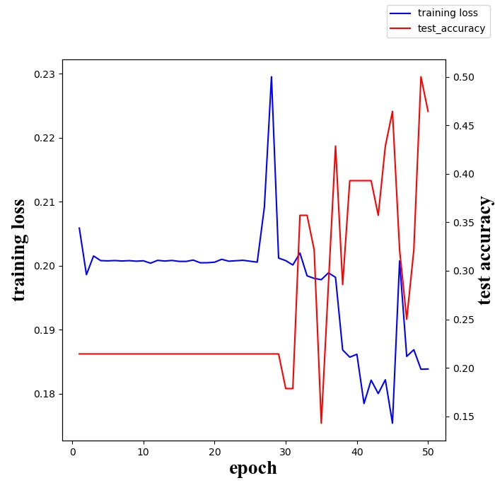

# AlexNet

## 环境配置
```
pytorch 1.2.0 + cuda 10.0
torchvision 0.4.0
```

## 数据集
使用 [CUB_200_2011](http://www.vision.caltech.edu/visipedia-data/CUB-200-2011/CUB_200_2011.tgz) 鸟类数据集

选择其中五个类别，分别为 001 002 014 004 005

具体使用以及文件配置见`data/ReadME.md`

## 训练结果


训练效果不佳，主要考虑一下几个问题：
* 数据集过少
* 训练次数不够，以及网络模型问题

## 预测结果
