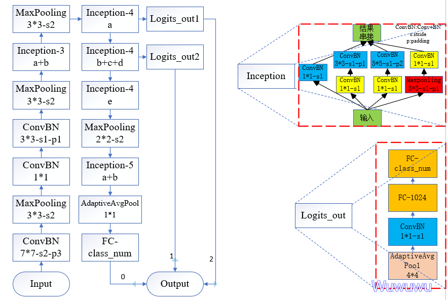
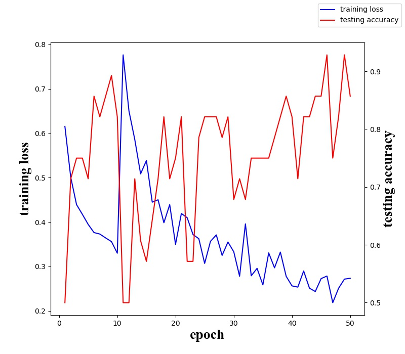
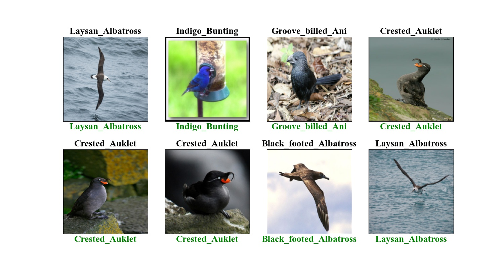

# AlexNet

## 环境配置
```
pytorch 1.2.0 + cuda 10.0
torchvision 0.4.0
```

## model
model.py 文件参考 pytorch 官方 VGG 文档，即 torchvison.models.googlenet.py

官方文件里实现了网络结构如下图所示



本次实验将 GoogLeNet 网络的最后一层以及辅助分类器替换成我们实际的类别，来实现数据迁移训练

所以需要自行去下载 GoogLeNet 预训练结果，并放到 `logs` 文件夹下，[下载地址](https://download.pytorch.org/models/googlenet-1378be20.pth)

## 数据集
使用 [CUB_200_2011](http://www.vision.caltech.edu/visipedia-data/CUB-200-2011/CUB_200_2011.tgz) 鸟类数据集

选择其中五个类别，分别为 001 002 014 004 005

具体使用以及文件配置见`dataset/birds/ReadME.md`

## 训练结果


## 预测结果
