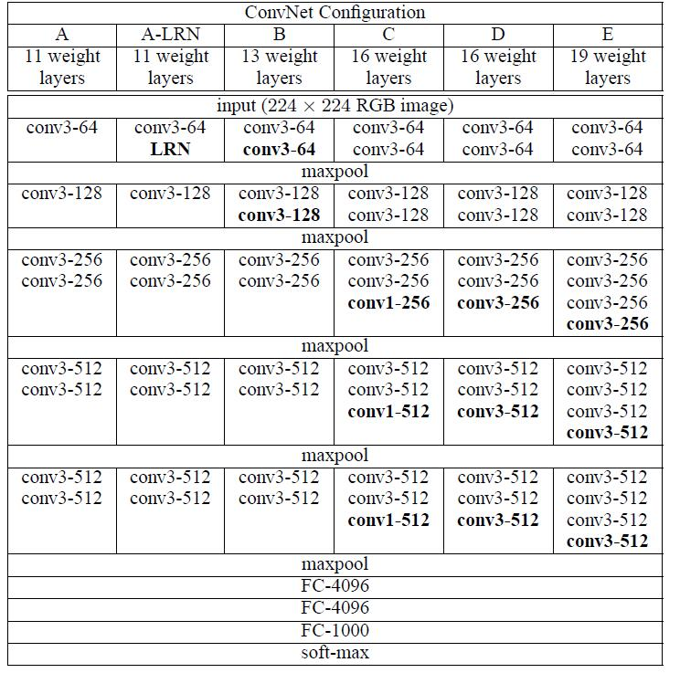
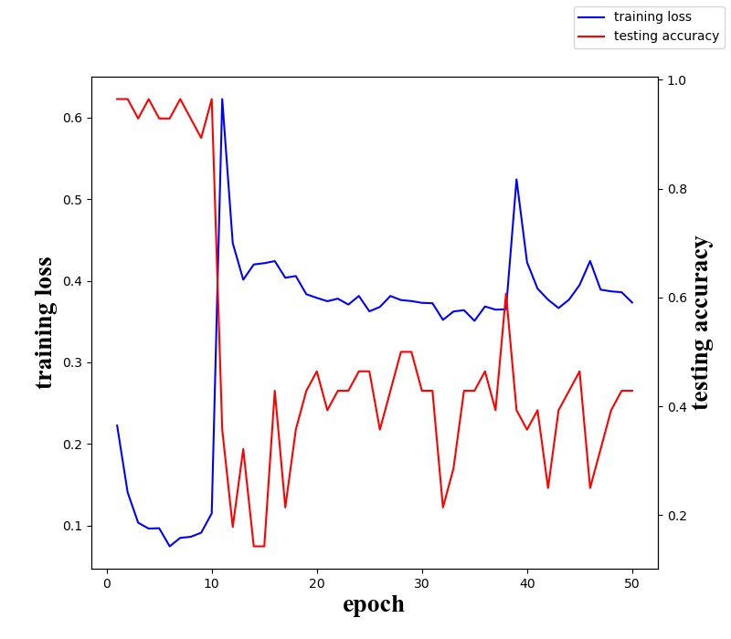
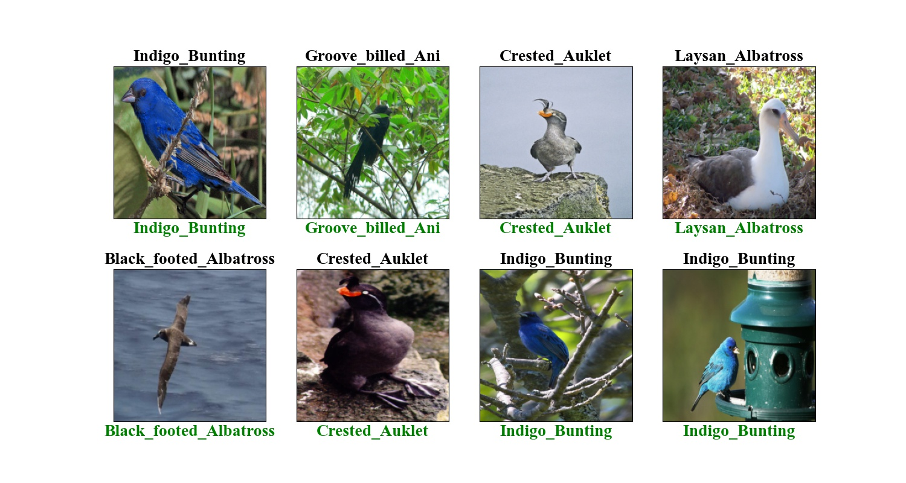

# AlexNet

## 环境配置
```
pytorch 1.2.0 + cuda 10.0
torchvision 0.4.0
```

## model
model.py 文件参考 pytorch 官方 VGG 文档，即 torchvison.models.vgg

官方文件里实现了 VGG11，VGG13，VGG16，VGG19 以及 BatchNormalization 形式，共 8 个模型。



对比论文中的格式，这里没有实现格式 C ，因为 C 中存在 1*1 的卷积核，在实现的时候容易产生冲突，所以 VGG16 只实现了 D，而实际中 D 也是最为常用的格式。

本次实验将 VGG16-BN 网络的最后一层替换成我们实际的类别，来实现数据迁移训练

## 数据集
使用 [CUB_200_2011](http://www.vision.caltech.edu/visipedia-data/CUB-200-2011/CUB_200_2011.tgz) 鸟类数据集

选择其中五个类别，分别为 001 002 014 004 005

具体使用以及文件配置见`data/ReadME.md`

## 训练结果


## 预测结果
